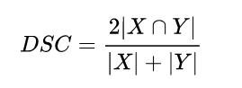

## Competition Description
Центр образовательных программ МФТИ совместно с ПАО «ГМК «Норильский никель», мировым лидером горно-металлургической отрасли, запускает магистерскую программу «AI Transformation в промышленности». Программа рассчитана на абитуриентов с высоким уровнем базовой подготовки в области программирования, анализа данных и машинного обучения.
Для поступления на программу претендентам предлагается показать высокий уровень навыков машинного обучения в ходе решения хакатон-задачи по определению рудозасоряющих объектов (арматура, балки и т. п.) на конвейере. Данная задача является одной из важных в производстве Норникеля. 
Решение позволяет своевременно сигнализировать выборщику о типе и размере идущего в мельницу нерудного объекта, что помогает работнику извлечь объект с конвейера до попадания его в мельницу, тем самым существенно уменьшив количество простоев мельницы из-за ремонтов. Вам предлагается решить данную задачу, определяя прямоугольные границы каждого из представленных типов рудозасоряющих объектов.

## Data Description

Вам предлагается научиться определять 3 класса объектов: арматура, дерево и “прочие”. В “прочие” могут войти любые объекты, как например, бутылки для напитков, так и огромные бронещиты на всю ширину ленты. Изображения поделены на 2 категории: train и test (находятся в папке testtrain\connected_images). Первоначальные результаты будут показываться по Public test, окончательные результаты будут определяться по Private test. Вам будут предоставлены изображения, а также файл train.csv, описывающий все объекты на train изображениях. Его структура следующая: image_name, type, xmin, ymin, xmax, ymax. Image_name - изображение, к которому относится данная запись; type - один из трех типов объектов; xmin, ymin, xmax, ymax - координаты рудозасоряющего объекта на изображении. Вам необходимо загрузить в систему аналогичный train_encoded.csv закодированный csv файл, описывающий рудозасоряющие на test выборке.
Функция кодирования пикселей доступна по ссылке: https://www.kaggle.com/mariadyakova/encoded-pixels
Описание файлов

    train.csv - Обучающая выборка
    train_encoded.csv - Обучающая выборка с закодированными пикселями
    sampleSubmission.csv - Пример возможного решения в правильном формате
    images/images - Папка с обучающими и тестовыми изображениями

Поля данных

    train.csv
    Image_name - Название изображения
    type - Тип объекта
    xmin,xmax,ymin,ymax - Границы объекта
    train_encoded.csv
    Image_name_Type -Название изображения с типом объекта
    EncodedPixels - Закодированные пиксели
    sampleSubmission.csv
    Image_name_Type - Название изображения с типом объекта
    EncodedPixels - Закодированные пиксели

## Evaluation

Данное соревнование оценивается по среднему Коэффициенту Сёренсена. 
Коэффициент Сёренсена используется для попиксельного сравнения предсказанной сегментации и соответствующей разметкой по формуле:

где X - предсказанное множество пикселей, а Y - соответствующая разметка. 
Коэффициент Сёренсена полагается равным 1, если оба множества X и Y пустые. 
Результат в таблице лидеров - это среднее коэффициентов Сёренсена по каждой паре <ImageId,ClassId>
в тестовой выборке.

### Кодировка пикселей

Для того чтобы уменьшить размер отправляемого файла, данная метрика использует кодирование последовательных пикселей. 
Вместо отправки избыточного списка всех пикселей сегментации, вам необходимо будет отправлять пары значений, 
состоящие из индекса начального пикселя и длины последовательных пикселей, следующих за ним, считая первый. 
Например, пара '1 3' означает начало в пикселе с индексом 1 и последовательность пикселей длины 3, то есть пиксели 1,2,3.

Формат требует, чтобы пары были разделены пробелами. 
Например, запись '1 3 10 5' означает, что пиксели с индексами 1,2,3,10,11,12,13,14 есть в сегментации. 
Метрика проверяет, что пары упорядочены, положительны, и закодированные пиксели не дублируются. 
Нумерация пикселей идет сверху вниз, слева направо, то есть 1 - это пиксель 1,1,2 - это пиксель 2,1 и т. д.

### Формат файла

Ваше решение должно быть в формате CSV с заголовком, содержащим названия столбцов: Image_name_Type, EncodedPixels.
Каждая строка данного файла представляет собой предсказанный объект для данного ImageId, и предсказанного ClassId. 
Число строк должно быть равно num_images⋅num_defect_classes. 
Для каждого класса объекта на изображении его сегмент должен быть закодирован в одну строку, 
в том числе если на изображении имеется несколько несмежных местоположений объектов.

Image_name_Type, EncodedPixels

0000Date_01_08_2019.jpg_armature, 1 1
0000Date_01_08_2019.jpg_other, 1 1
0000Date_01_08_2019.jpg_wood, 5 70

и т.д.